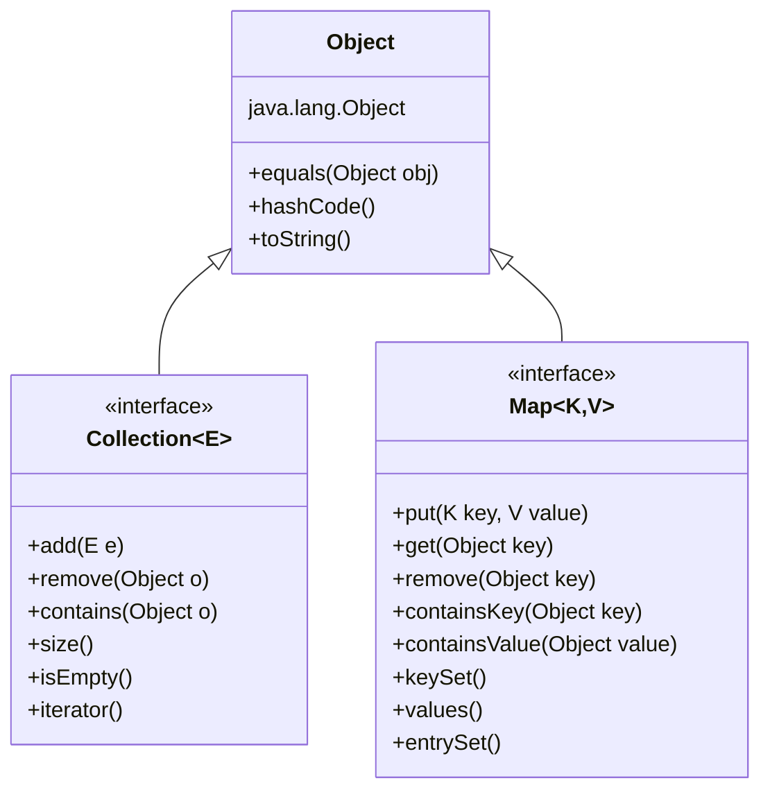
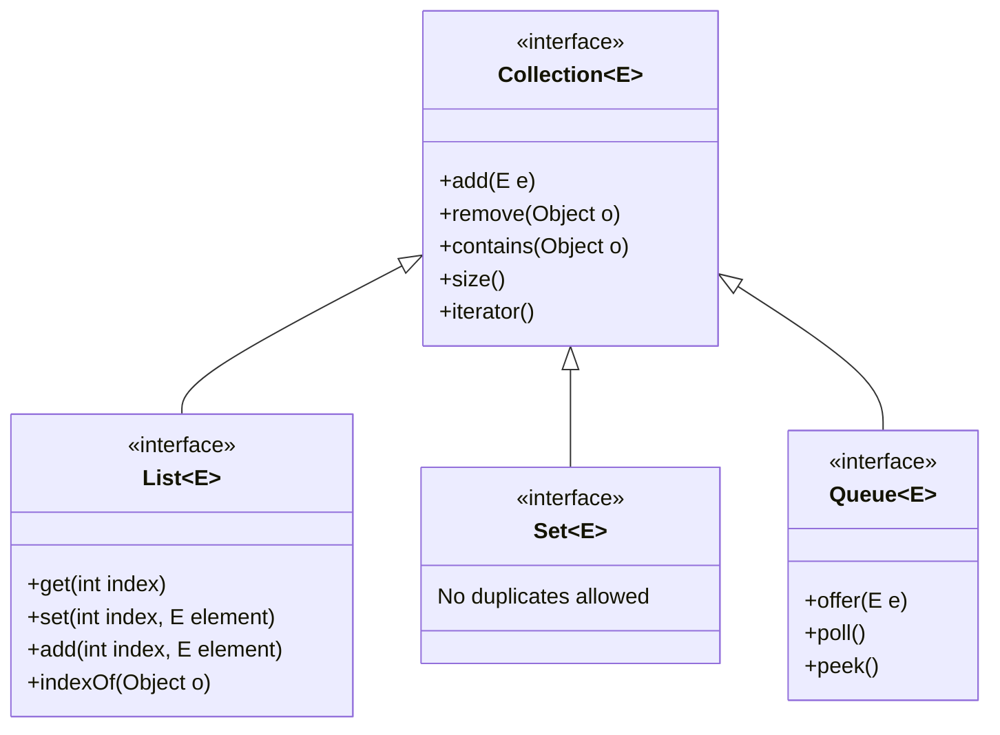
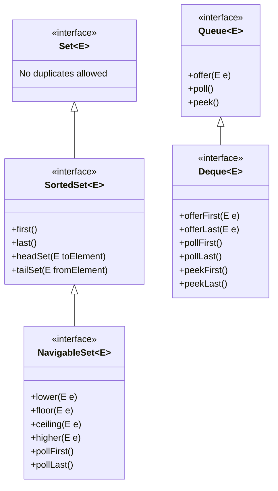
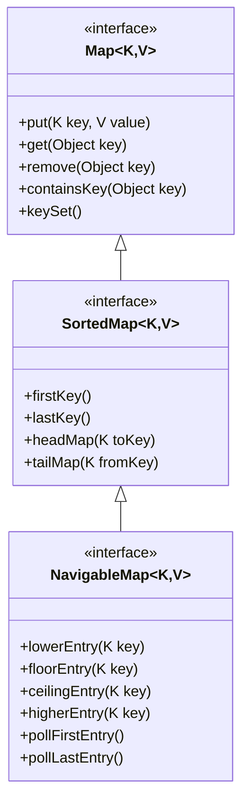
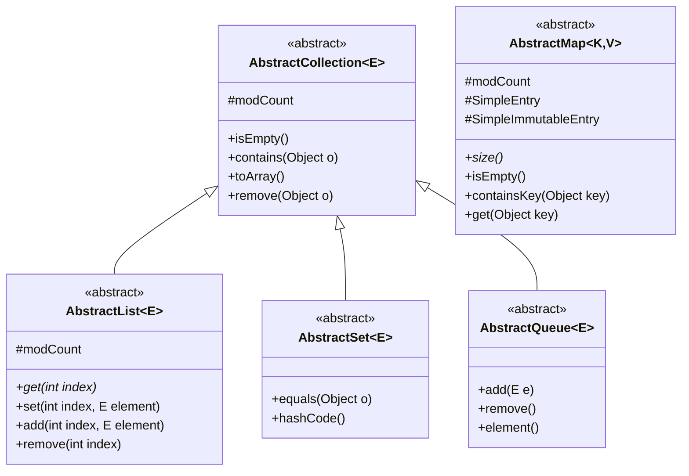
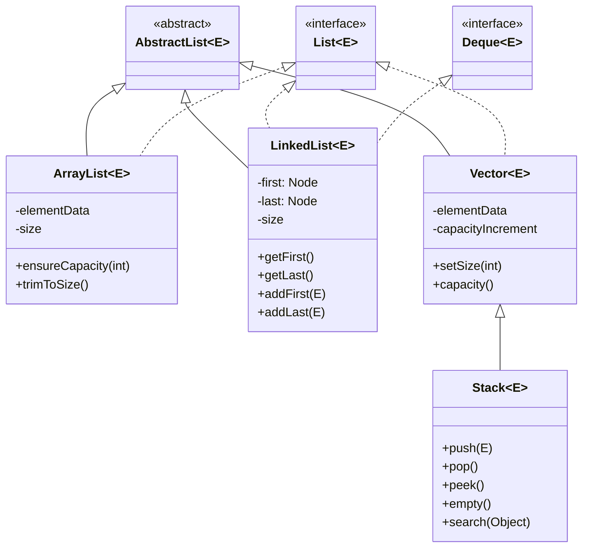
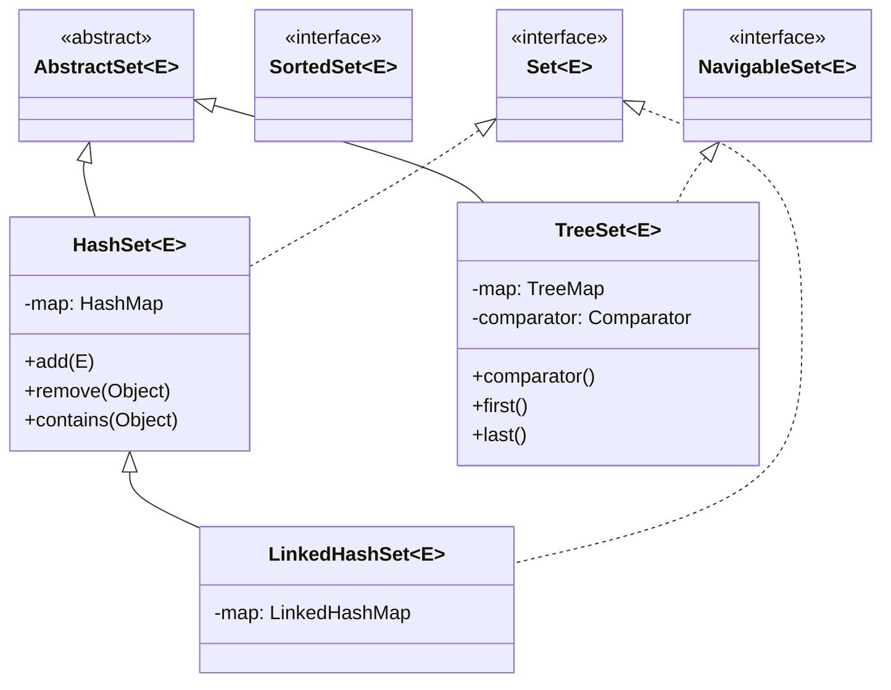
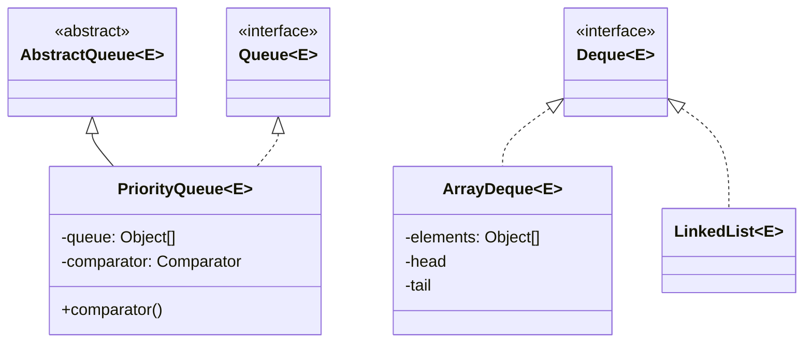
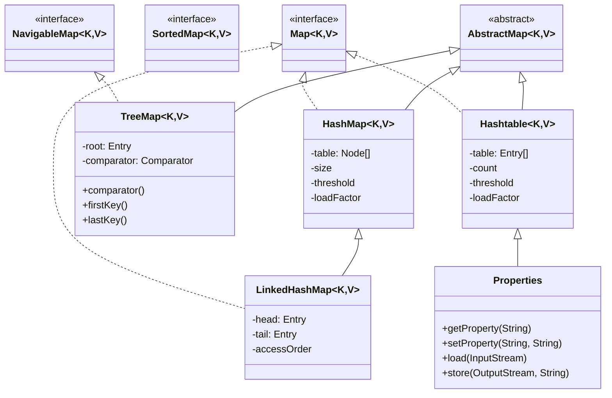

# JAVA -> COLLECTIONS FRAMEWORK
## SUMMARY
> [!summary]

## THEORY

The Java Collections Framework can be better understood by breaking it down into its main hierarchies. Let's explore each part with clear explanations and focused diagrams.

### THE FOUNDATION: OBJECT AND CORE INTERFACES

Everything in Java ultimately extends from `Object`. The Collections Framework builds upon this with several core interfaces.



The Collections Framework has two primary branches extending from `Object`:

1. **`Collection<E>`** - The root interface for storing groups of objects
    
    - Defines basic operations like adding, removing, and checking for elements
    - All collection types implement this interface (except Maps)
2. **`Map<K,V>`** - A separate branch for storing key-value pairs
    
    - Does not extend from `Collection` since it stores paired data rather than individual elements
    - Provides operations for accessing values by their keys

This separation is fundamental to understanding the framework: Collections store elements, Maps store key-value pairs.

### THE COLLECTION INTERFACE HIERARCHY

Let's expand the `Collection` branch to see its primary sub-interfaces:



Each of these sub-interfaces defines a distinct collection behavior:

- **`List<E>`** - An ordered collection that allows duplicates and provides index-based access
    
    - Elements have specific positions
    - You can add elements at specific positions
    - You can access elements by their index
- **`Set<E>`** - A collection that cannot contain duplicate elements
    
    - Based on mathematical set theory
    - No concept of position or ordering (in most implementations)
    - Useful for ensuring uniqueness
- **`Queue<E>`** - A collection designed for holding elements before processing
    
    - Typically follows FIFO (first-in-first-out) order
    - Provides operations for adding, removing, and examining elements

### EXTENDED COLLECTION INTERFACES

Each primary collection interface has specialized extensions that add functionality:



These extended interfaces add specialized behaviors:

- **`SortedSet<E>`** extends `Set<E>` to maintain elements in a sorted order
    
    - Provides methods to retrieve ranges of elements
    - Elements must be comparable
- **`NavigableSet<E>`** extends `SortedSet<E>` to provide navigation methods
    
    - Adds methods to find elements relative to a given value
    - Enables powerful range-based operations
- **`Deque<E>`** (double-ended queue) extends `Queue<E>`
    
    - Allows elements to be added or removed from both ends
    - Can be used as a queue, stack, or both

### THE MAP INTERFACE HIERARCHY

Maps have their own hierarchy of interfaces:



The Map hierarchy mirrors some of the patterns seen in the Collection interfaces:

- **`SortedMap<K,V>`** extends `Map<K,V>` to maintain keys in sorted order
    
    - Provides methods to retrieve ranges of key-value pairs
    - Keys must be comparable
- **`NavigableMap<K,V>`** extends `SortedMap<K,V>` to provide navigation methods
    
    - Adds methods to find entries relative to a given key
    - Enables range operations and relative key finding

### ABSTRACT CLASSES AS PARTIAL IMPLEMENTATIONS

The framework provides abstract classes that partially implement the interfaces:



These abstract classes serve an important purpose:

- They reduce the effort needed to implement collection interfaces
- They provide default implementations for common methods
- They enforce consistent behavior across concrete implementations
- Methods marked with * are often left abstract for concrete classes to implement

### LIST IMPLEMENTATIONS

Now let's look at the concrete implementations of the `List` interface:



The `List` implementations each have distinct characteristics:

- **`ArrayList<E>`** - Uses a resizable array internally
    
    - Fast random access with O(1) time complexity
    - Adding/removing at the end is usually O(1)
    - Adding/removing elsewhere requires shifting elements (O(n) in worst case)
    - Good general-purpose implementation for most use cases
- **`LinkedList<E>`** - Uses doubly-linked nodes
    
    - O(1) insertions and removals when you have a reference to the position
    - O(n) time for random access operations like get(index)
    - Also implements the `Deque` interface for convenient first/last operations
    - Good for frequent insertions/deletions or when implementing a queue
- **`Vector<E>`** - Legacy class, thread-safe version of ArrayList
    
    - Similar to ArrayList but with synchronized methods
    - Less efficient than ArrayList for single-threaded applications
    - Generally not recommended for new code (use ArrayList with external synchronization if needed)
- **`Stack<E>`** - Legacy class for LIFO (last-in-first-out) operations
    
    - Extends Vector
    - Provides push(), pop(), and peek() operations
    - Recommended alternative: use ArrayDeque for stack operations

### SET IMPLEMENTATIONS

The `Set` interface has several implementations with different characteristics:



The `Set` implementations offer different performance and behavior tradeoffs:

- **`HashSet<E>`** - Uses a HashMap internally (elements as keys)
    
    - O(1) performance for add, remove, contains
    - No guarantees about iteration order
    - Null elements are permitted
    - Best choice for general-purpose set implementation
- **`LinkedHashSet<E>`** - Extends HashSet but uses LinkedHashMap internally
    
    - Maintains insertion order during iteration
    - Slightly slower than HashSet for operations
    - Good choice when iteration order matters
- **`TreeSet<E>`** - Uses a TreeMap internally
    
    - Elements stored in sorted order (natural ordering or custom Comparator)
    - O(log n) performance for add, remove, contains
    - Implements NavigableSet for range operations and relative element finding
    - Good choice when you need elements maintained in a specific order

### QUEUE AND DEQUE IMPLEMENTATIONS

The Queue and Deque interfaces have these implementations:



These queue implementations serve different purposes:

- **`PriorityQueue<E>`** - Heap-based priority queue
    
    - Elements ordered by natural ordering or custom Comparator
    - O(log n) time for insertion and removal operations
    - O(1) time for peek operations
    - Not thread-safe
    - Good for processing elements by priority
- **`ArrayDeque<E>`** - Resizable array implementation of Deque
    
    - More efficient than LinkedList for most Deque operations
    - No capacity restrictions
    - Not thread-safe
    - Good general-purpose queue and stack implementation
- **`LinkedList<E>`** - Also implements Deque interface
    
    - Doubly-linked list implementation
    - O(1) for adding/removing from both ends
    - Can be used as a Queue, Deque, or List
    - Versatile but sometimes less efficient than specialized implementations

### MAP IMPLEMENTATIONS

Finally, let's look at the concrete implementations of the `Map` interface:



The Map implementations offer different characteristics and use cases:

- **`HashMap<K,V>`** - Hash table implementation of the Map interface
    
    - O(1) performance for get and put operations
    - Keys can include null
    - No guarantees about iteration order
    - Most frequently used Map implementation
- **`LinkedHashMap<K,V>`** - Hash table with linked list implementation
    
    - Maintains insertion order (by default) or access order (optional)
    - Slightly slower than HashMap for operations
    - Useful when iteration order matters
- **`TreeMap<K,V>`** - Red-black tree implementation
    
    - Maintains keys in sorted order (natural ordering or via Comparator)
    - O(log n) time for most operations
    - Implements NavigableMap for range operations
    - Useful when you need sorted keys
- **`Hashtable<K,V>`** - Legacy synchronized map implementation
    
    - Thread-safe but less efficient than HashMap
    - Does not allow null keys or values
    - Generally replaced by ConcurrentHashMap for thread-safe operations
- **`Properties`** - Specialized Hashtable for String to String mappings
    
    - Used for configuration properties
    - Can be loaded from and stored to files
    - Provides default values

###. Understanding Implementation Relationships

A critical aspect of the Java Collections Framework is understanding how implementations relate:

1. **Internal Implementation Relationships**:
    
    - `HashSet` uses a `HashMap` internally
    - `LinkedHashSet` uses a `LinkedHashMap` internally
    - `TreeSet` uses a `TreeMap` internally
2. **Multiple Interface Implementation**:
    
    - `LinkedList` implements both `List` and `Deque` interfaces
3. **Legacy vs. Modern**:
    
    - Legacy classes: `Vector`, `Stack`, `Hashtable`, `Properties`
    - Modern replacements: `ArrayList`, `ArrayDeque`, `HashMap`, `ConcurrentHashMap`

###. Usage Guidelines

Based on the above explanations, here are some guidelines for choosing implementations:

1. **For Lists**:
    
    - Default choice: `ArrayList` - good general performance
    - For frequent insertions/deletions at arbitrary positions: `LinkedList`
    - For concurrent access: `CopyOnWriteArrayList` (from concurrent package)
2. **For Sets**:
    
    - Default choice: `HashSet` - best general performance
    - When iteration order matters: `LinkedHashSet`
    - When elements need to stay sorted: `TreeSet`
    - For concurrent access: `CopyOnWriteArraySet` (from concurrent package)
3. **For Queues/Deques**:
    
    - Default queue: `ArrayDeque`
    - For priority-based processing: `PriorityQueue`
    - For concurrent access: Classes from concurrent package
4. **For Maps**:
    
    - Default choice: `HashMap` - best general performance
    - When iteration order matters: `LinkedHashMap`
    - When keys need to stay sorted: `TreeMap`
    - For concurrent access: `ConcurrentHashMap` (from concurrent package)

###. Performance Characteristics

Understanding the big-O performance of common operations helps in selecting the right implementation:

|Implementation|get/contains|add/remove|Notes|
|---|---|---|---|
|ArrayList|O(1)|O(n)|Random access, iteration, and rare modifications. Add at end is O(1) when no resizing needed. Default List choice for most use cases.|
|LinkedList|O(n)|O(1)|Frequent insertions/removals at both ends when used as a Queue/Deque. Despite O(1) for insertions, ArrayList often outperforms in practice for most scenarios.|
|HashSet|O(1)|O(1)|Fast lookups and uniqueness checking. Average case performance. Default Set choice when order doesn't matter.|
|LinkedHashSet|O(1)|O(1)|When you need both fast lookups and predictable iteration order. Slightly more overhead than HashSet.|
|TreeSet|O(log n)|O(log n)|Maintaining elements in sorted order and range operations. Use when you need data to stay sorted.|
|HashMap|O(1)|O(1)|Key-value lookups with maximum performance. Average case. Default Map choice for most use cases.|
|LinkedHashMap|O(1)|O(1)|Predictable iteration order with fast lookups. Can be configured for access-order (LRU cache behavior).|
|TreeMap|O(log n)|O(log n)|Sorted key-value pairs and range operations on keys. Use when you need keys to stay sorted.|

This table shows how quickly different operations run for each collection type. The "O(...)" notation indicates time complexity:

- O(1) means constant time (fast)
- O(n) scales linearly with the number of elements (slower as n grows)
- O(log n) scales logarithmically (faster than linear but slower than constant)

This comprehensive breakdown should help you understand the Java Collections Framework more clearly. Each diagram focuses on a specific part of the framework, making it easier to visualize the relationships while studying in Obsidian.

# ORDERING IN TREESET/TREEMAP VS. LINKEDHASHSET/LINKEDHASHMAP

The key difference between these collection types lies in _how_ they maintain order and _what kind_ of order they preserve.

## TREESET AND TREEMAP: SORTED ORDER

TreeSet and TreeMap maintain elements in **sorted order** based on a specific sorting criterion:

1. **Natural ordering** - If the elements implement the `Comparable` interface, they'll be ordered according to their `compareTo()` method. For example, integers will be sorted numerically (1, 2, 3...), and strings alphabetically ("apple", "banana", "cherry"...).
    
2. **Custom ordering** - You can provide a `Comparator` at construction time to define a custom sorting order.
    

When you iterate through a TreeSet or the keys of a TreeMap, you'll always encounter elements in this sorted order, regardless of the insertion sequence.

```java
TreeSet<String> fruits = new TreeSet<>();
fruits.add("banana");
fruits.add("apple");
fruits.add("cherry");

// Iterating will give: "apple", "banana", "cherry" (alphabetical order)
```

The sorting is maintained dynamically—whenever you add a new element, it's placed in its correct position according to the sort order. This sorting functionality comes at a performance cost, as operations typically run in O(log n) time rather than the O(1) time of hash-based collections.

## LINKEDHASHSET AND LINKEDHASHMAP: INSERTION ORDER

LinkedHashSet and LinkedHashMap maintain elements in **insertion order** by default. They remember the sequence in which elements were added:

```java
LinkedHashSet<String> fruits = new LinkedHashSet<>();
fruits.add("banana");
fruits.add("apple");
fruits.add("cherry");

// Iterating will give: "banana", "apple", "cherry" (insertion order)
```

They accomplish this by combining a hash table (for fast access) with a doubly-linked list (to maintain order). This gives them nearly the same performance characteristics as HashSet and HashMap (O(1) for basic operations) while adding the predictable iteration order.

LinkedHashMap actually offers an additional capability: it can maintain elements in **access order** instead of insertion order by setting a parameter in its constructor:

```java
// The "true" parameter specifies access-order (instead of insertion-order)
LinkedHashMap<String, Integer> cache = new LinkedHashMap<>(16, 0.75f, true);
```

In access-order mode, each time you get or put an entry, it moves to the end of the iteration sequence. This makes LinkedHashMap suitable for implementing LRU (Least Recently Used) caches.

## REGULAR HASHSET AND HASHMAP

For completeness, it's worth noting that regular HashSet and HashMap make no guarantees about iteration order. The order may appear random and can change when the collection is modified or even between different program runs.

## PRACTICAL IMPLICATIONS

These ordering differences lead to different use cases:

**Use TreeSet/TreeMap when:**

- You need elements in a specific sorted order
- You frequently need to find the smallest or largest element
- You need to retrieve ranges of elements
- You need to find elements closest to a given value

**Use LinkedHashSet/LinkedHashMap when:**

- You need to maintain insertion order
- You're implementing a simple "first-in, first-out" policy
- You want predictable iteration for debugging or logging
- You're implementing an LRU cache (LinkedHashMap with access-order)

**Use HashSet/HashMap when:**

- Order doesn't matter
- You want the fastest possible performance for basic operations

Understanding these ordering characteristics helps you choose the right collection type for your specific requirements.
## QUESTIONS
> [!tip]- Question
> Answer

> [!warning]- Question
> Answer

> [!danger]- Question
> Answer
- - - 
